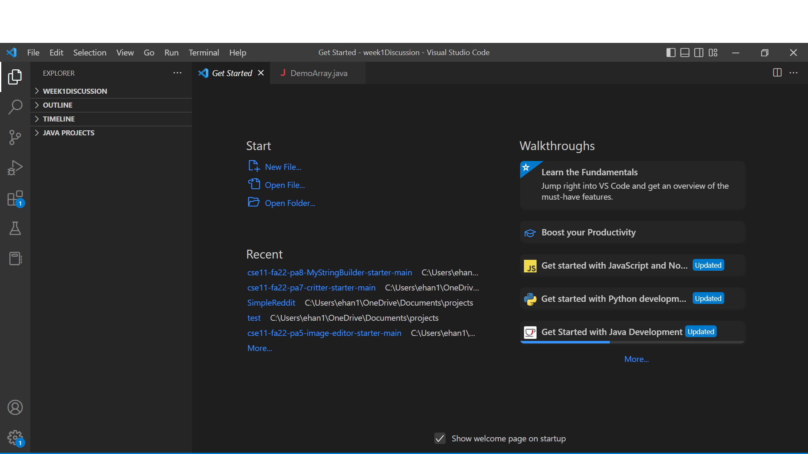
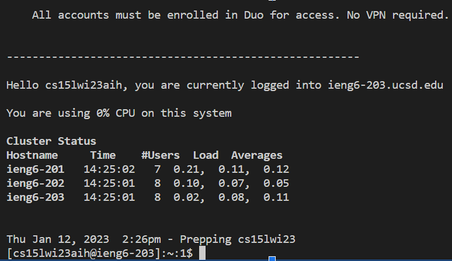
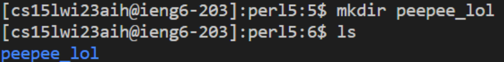

# Lab Report 1

# Part 1: Accessing your Course-specific Account and Installing VSCode
---
**In order to remotely connect to the CSE basement computers, we need to find our course specific account name.**

To do this, follow this tutorial to find your account name. Once you have it, write it down or copy it because we will need it later. :)


Click on this link to access your account: [Link](https://sdacs.ucsd.edu/~icc/index.php)

Here is a tutorial to change your password in case it is your first time accessing your account: [Link](https://docs.google.com/document/d/1hs7CyQeh-MdUfM9uv99i8tqfneos6Y8bDU0uhn1wqho/edit)


**Your account should looks something like this: `cs15lwi23XXX`

Good job :)

---

**Now that you have your login, it is time to install VSCode.**

Install VSCode here: [Link](https://code.visualstudio.com/)

Once installed, open VSCode. Your screen should look like this:




# Part 2: SSH :)

First, install git [here](https://sdacs.ucsd.edu/~icc/index.php).

Then, we will use the terminal to use `git bash`.

Follow [this](https://sdacs.ucsd.edu/~icc/index.php) tutorial.

To remote connect, open a terminal:


To use ssh, type in this command, where the XXXs are the last 3 letters of your cse15l username: 

``$ ssh cs15lwi23XXX@ieng6.ucsd.edu``

**NOTE: You don't need to type in the '$', it is just a convention of command writing.**

Since it is your first time connecting to the remote server, you will most likely get a few prompts. Enter yes to all of them. 

**If your terminal displays something like this, it means your are in!**



**Try typing in a few commands!**

Here are some to try:

```
pwd
mkdir
cp
cd ~
cd
ls -lat
ls -a
```

Here is an example command of me making a directory with the 'mkdir' command:



---

## YAAY U DID IT GOOD JOB ILY <333


