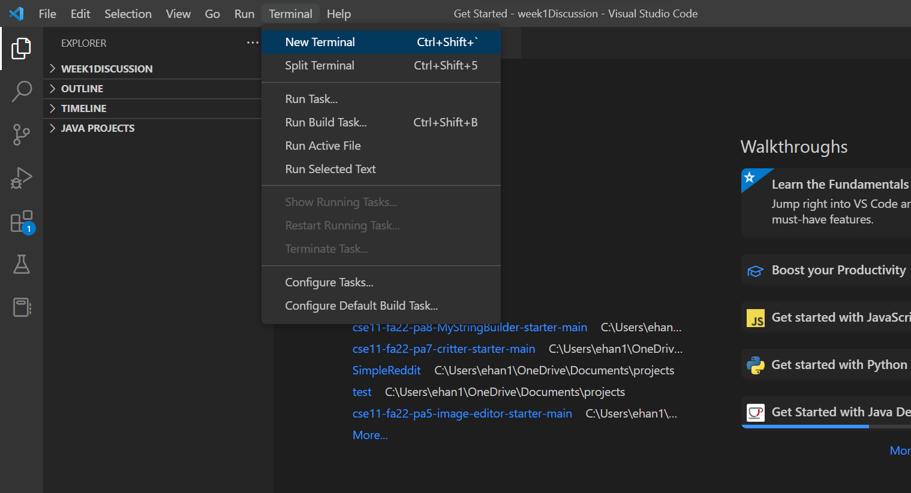

# Lab Report 1: Accessing Course-Specific Accounts, Installing VSCode and Interacting with a Remote Machine

**This tutorial will teach you how to access your course specific accounts, install vscode and interact with a remote machine.**

# Part 1: Accessing your Course-Specific Account and Installing VSCode
---
**In order to remotely connect to the CSE basement computers, we need to find our course specific account name.**

To do this, follow this tutorial to find your account name. Once you have it, write it down or copy it because we will need it later. :)

Click on this link to access your account: [Link](https://sdacs.ucsd.edu/~icc/index.php)

Here is a tutorial to change your password in case it is your first time accessing your account: [Link](https://docs.google.com/document/d/1hs7CyQeh-MdUfM9uv99i8tqfneos6Y8bDU0uhn1wqho/edit)

**Your account should looks something like this: `cs15lwi23XXX`

Good job :)

---

**Now that you have your login, it is time to install VSCode.**

Install VSCode here: [Link](https://code.visualstudio.com/)

Once installed, open VSCode. Your screen should look like this:

# Part 2: Installing Git and Remotely Connecting

**Git Bash is a command-line based version control system. The original Git was a Unix-style command line application, so Git Bash emulates that environment to keep the efficiency of the original command-line git.**

First, install git [here](https://gitforwindows.org/).

Then, we will use the terminal to use `git bash`.

Follow [this](https://stackoverflow.com/questions/42606837/how-do-i-use-bash-on-windows-from-the-visual-studio-code-integrated-terminal/50527994#50527994) tutorial if you have trouble installing Git and opening a bash terminal.

To remotely connect, open a terminal:

To use ssh, type in this command, where the XXXs are the last 3 letters of your cse15l username: 

``$ ssh cs15lwi23XXX@ieng6.ucsd.edu``

**NOTE: You don't need to type in the '$', it is just a convention of command writing.**

Since it is your first time connecting to the remote server, you will most likely get a few prompts. Enter yes to all of them. 

**If your terminal displays something like this, it means you are in!**

**Try typing in a few commands!**

Here are some to try:

    pwd - This will print the current working directory. 
    mkdir - This command will make a directory.
    cp - This command copies files.
    cd ~ - This command changes the directory to the Home directory.
    cd - This changes the directory to whatever argument is passed to it. ex: cd /home/linux/ieng6/cs15lwi23/public/hello.txt
    ls -lat - This command lists all directories and files in order of time, as well as extra details.
    ls -a - This command lists all directories and files, including hidden files and folders.

Here is an example command of me making a directory with the 'mkdir' command:

---

## YAAY U DID IT GOOD JOB ILY <333

