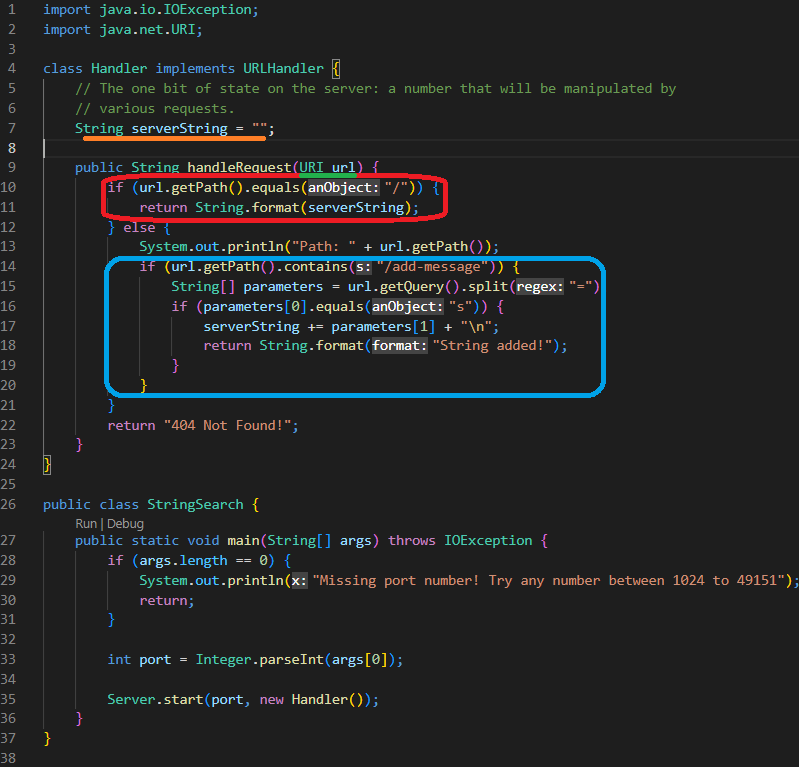
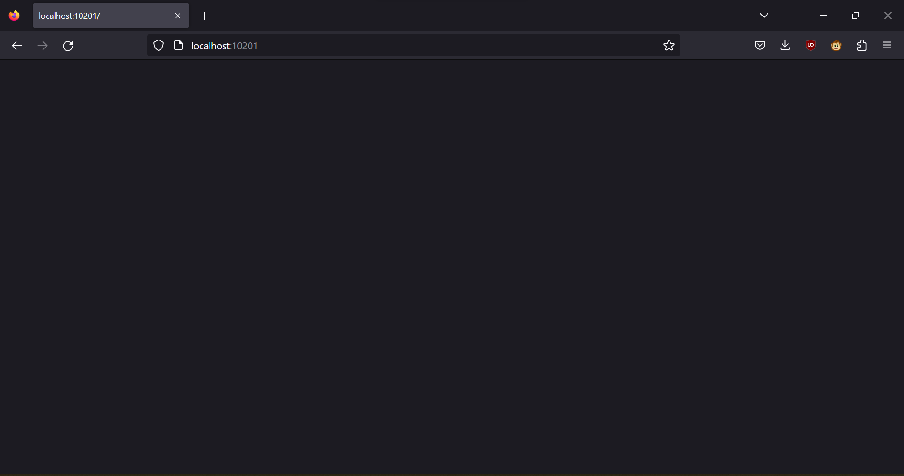
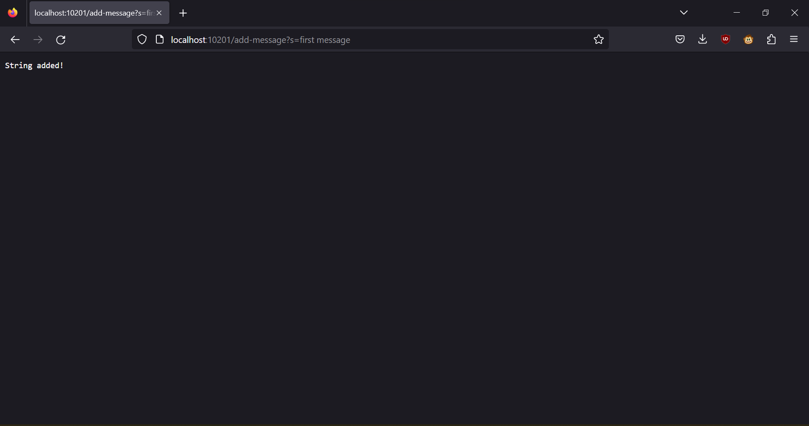
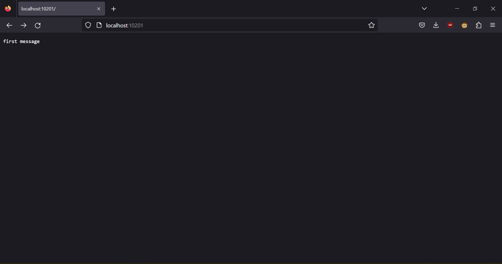
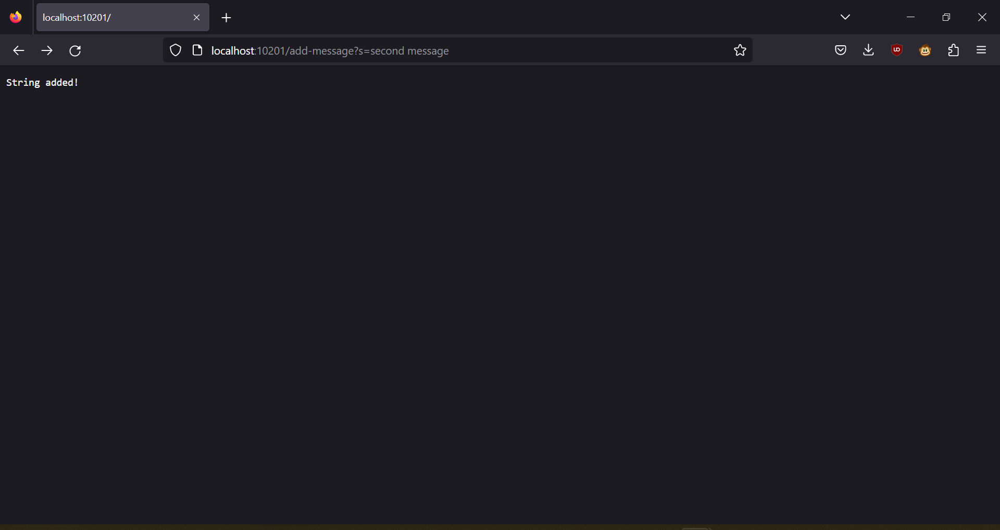
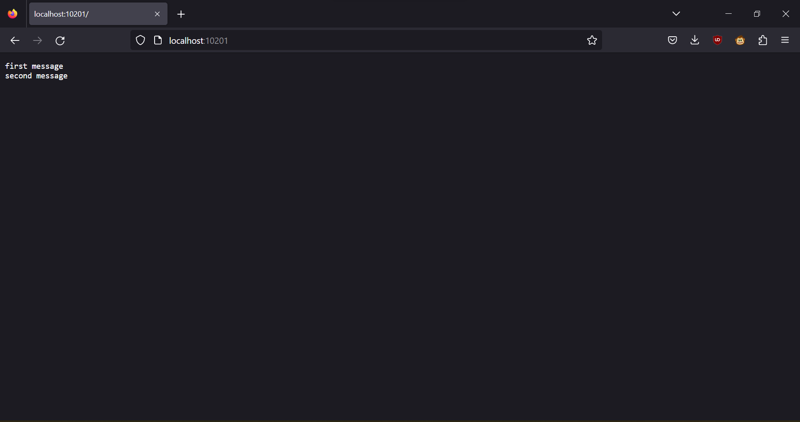

# Lab Report 2: Servers and Bugs

**This tutorial will demonstrate the creation of a web server and some bug testing.**

# Part 1: Writing and Running a Web Server

---

**We will be writing a java class called StringServer. It will keep track of a single string and print it to the server. We will modify the strings with this request:**

``/add-message?s=<string>``

When we recieve this query, we will concatenate the argument after the "s=" to our server string.

This is what our code looks like:


## Things to note:

1. Underlined in orange is our string for storing what will be displayed on the main page, "serverString". 
   When an add-message query is recieved, whatever is passed will be concatenated to this string.
2. Underlined in green is our URI object. The difference between a URI and a URL is that a 
   "URI identifies a resource and differentiates it from others by using a name, location, or both. 
   URL identifies the web address or location of a unique resource."
3. Our request handler is composed of two if statements. When it is called, we retrieve the path and 
   check if it is either "/" or "/add-message". 
   - Circled in red is the code for an empty string. This is where we display the stored string.
   - Circled in blue is the code for adding a string. These lines concatenate the entered string and a new line.
---
 **Here's a demonstration of how our server will function:**
 
First, we will start the server in the console using this command, where the numbers are the port number: ``java StringSearch 12101``
 
This is what we see in the console:


   
If we navigate to the link provided, this is what we see:
(note: the port is different because I took the screenshots at different times, but normally it would be the same.) 

 
 
 Lets add a string:
 
 
 
 Now lets see if it worked:
 
 
 
 Lets add another string:
 
 
 
 And navigate to the main page:
 
 
 
 
 
---

# Part 2: Bug Testing

**Here, I will demonstrate some basic JUnit testing and bugfixing.**

We will have two classes, ArrayExamples.java and ArrayTests.java. 

This is ArrayExamples, and it contains the method we will be testing:

```
  // Changes the input array to be in reversed order
  static void reverseInPlace(int[] arr) {
    for(int i = 0; i < arr.length; i += 1) {
      arr[i] = arr[arr.length - i - 1];
    }
  }
```

**Lets test our method with these two testers. One of them works, and the other does not.


**Lets look at the output from the unit tester:**


**The reason the second tester fails is because our method replaces the indices instead of swapping them. When there is only one 
element, the array remains unchanged. Instead, lets iterate to the middle of the array, swapping the opposite ends while we do so.
We will need to make a new var, currInt, to store the number we are swappping.**

``` 
// Changes the input array to be in reversed order
  static void reverseInPlace(int[] arr) {
    int currInt;
    for (int i = 0; i < arr.length / 2; i += 1) {
      currInt = arr[i];
      arr[i] = arr[arr.length - i - 1];
      arr[arr.length - i - 1] = currInt;
    }
  }
```

**Lets run the tester again.**


**Yay it worked!! Lets move on to part 3.**

# Part 3: What I learned

**Here I will tell you in 1 or 2 sentences something I learned this week.**

This week, I learned about unit testing, specifically the differences between a symptom, a bug and a failure-inducing input.
A failure-inducing input is an input that causes the program to behave incorrectly. 
A symptom is an incorrect behavior that is caused by a bug.


